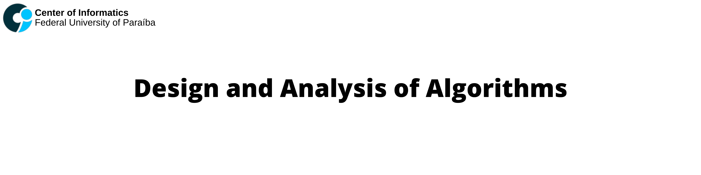

  

This repository contains the main algorithms developed in the course Design and Analysis of Algorithms at [UFPB](https://www.ufpb.br), oriented by [Professor Bruno Petrato Bruck](http://lattes.cnpq.br/8375218408755980). 

## Table of Contents
- [References:](#references)

## References:
- Thomas H. Cormen (2009). Introduction to Algorithms, 3rd Edition (The MIT Press)  
- Sanjoy Dasgupta, Christos H. Papadimitriou, and Umesh Vazirani. 2006. Algorithms (1st. ed.). McGraw-Hill, Inc., USA.  
- Sedgewick, R., Wayne, K. (2011). Algorithms, 4th Edition.. Addison-Wesley. ISBN: 978-0-321-57351-3  

